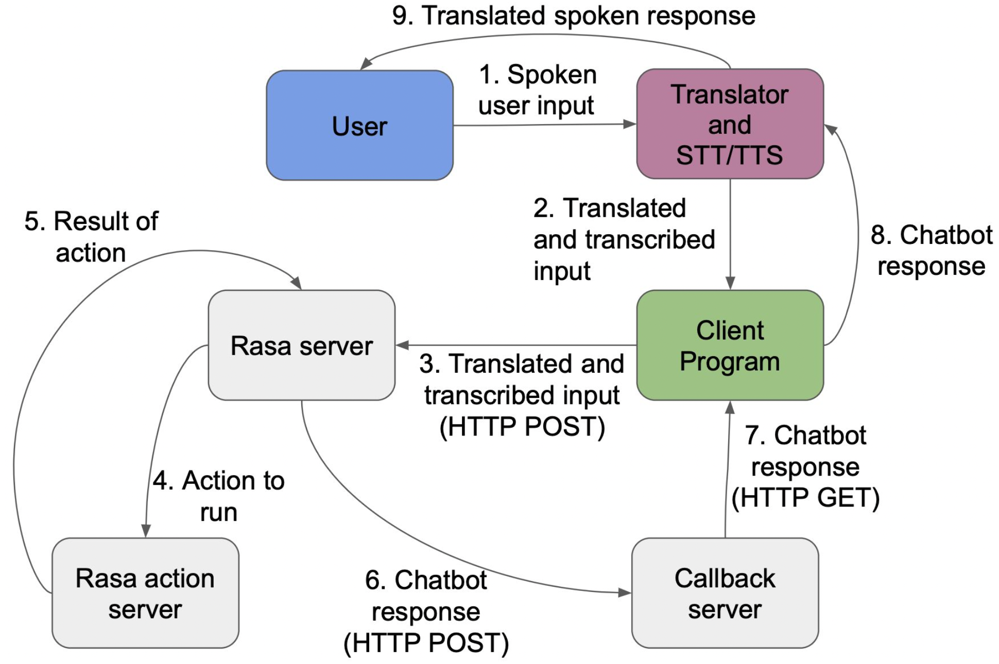

# Multilingual Chatbot
Multilingual chatbot which would be part of an office robot. The office robot can move around, pick up objects, get someone's lunch, close doors/windows, etc. The chatbot provides the ability to converse with people, take natural language instructions from them and translate it into an action for the robot. Conversations with the chatbot can happen in English and twelve Indian languages. They can also happen as text-to-text or speech-to-speech conversations. The languages supported are Assamese, Bangla, English, Gujarati, Hindi, Kannada, Malayalam, Marathi, Odia, Punjabi, Tamil, Telugu and Urdu.
  
## State Machine
The internal state of the robot is maintained using a state machine in SMACH. The state machine of the robot triggers the chatbot when it enters the *Conversing* state. The robot will converse with a person as long as it is in the *Conversing* state. The conversation can stop in the following cases
- User ends the conversation
- User requests their lunch or an object or wants a door/window closed (the robot will transition to a different state to do what is requested)
- Battery is low (the robot will go and charge). The state machine is able to interrupt the chatbot when the battery is low

Once the conversation ends, the chatbot returns information to the state machine. This information influences the next state of the state machine and consequently the robot’s next action.
  

<i>Part of the robot’s state machine involving the chatbot</i>

  
## Chatbot implementation
The chatbot was developed using Rasa. Popular, high quality pre-trained NLP models are available only for English and so to support multilingual conversations we first translate the user’s input into English, give it to the chatbot and then convert the chatbot’s English response back to the language chosen. Translation, speech-to-text and text-to-speech are done using Azure Cognitive Services.

The chatbot requires three servers to be running.  
1. Rasa server: the model is loaded here and predictions of what to do next occur here  
2. Rasa action server: custom actions are executed here  
3. Callback server: the chatbot sends it's responses here

Communication between the state machine and chatbot as well as the front end and chatbot occurs through HTTP requests.
  

<i>Sequence of steps in the execution of the chatbot</i>
